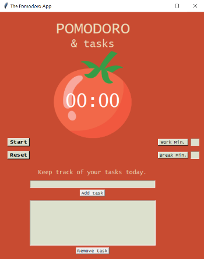

_This README.md file is in English and Portuguese. // Esse arquivo README.md está em Inglês e Português._

# EN: tkinter-pomodoro-app

⚠️ _This was done as I followed up Angela Yu's Python Bootcamp. I changed what was seen in the tutorial in order to add new features and layout, to deepen my knowledge. You can find the course [on Udemy here](https://www.udemy.com/course/100-days-of-code/)._ ⚠️

The time management technique of "Pomodoro" recreated as a Tkinter App, all built in Python, inspired by Angela Yu's Bootcamp. It has two added functionalities:

* the possibility to add and remove tasks to remember (Tkinter Listbox);
* the possibility to adjust work and long break minutes;

Final version.

---
# PT: tkinter-app-pomodoro

⚠️ _Isso foi feito enquanto eu seguia o Bootcamp da Angela sobre Python. Eu mudei o que foi visto no tutorial para adicionar novas features e também o layout, de modo a aprofundar meus conhecimentos. Você consegue achar o curso [na Udemy aqui](https://www.udemy.com/course/100-days-of-code/)._ ⚠️

A técnica de gerenciamento de tempo "Pomodoro" recriada como um Tkinter App, feito em Python, inspirado no bootcamp Angela Yu's. Tem duas funcionalidades adicionais:

* a possibilidade de adicionar e remover tarefas para lembrar (Tkinter Listbox);
* a possibilidade de ajustar os minutos de trabalho e descanso longo;

Versão final.
